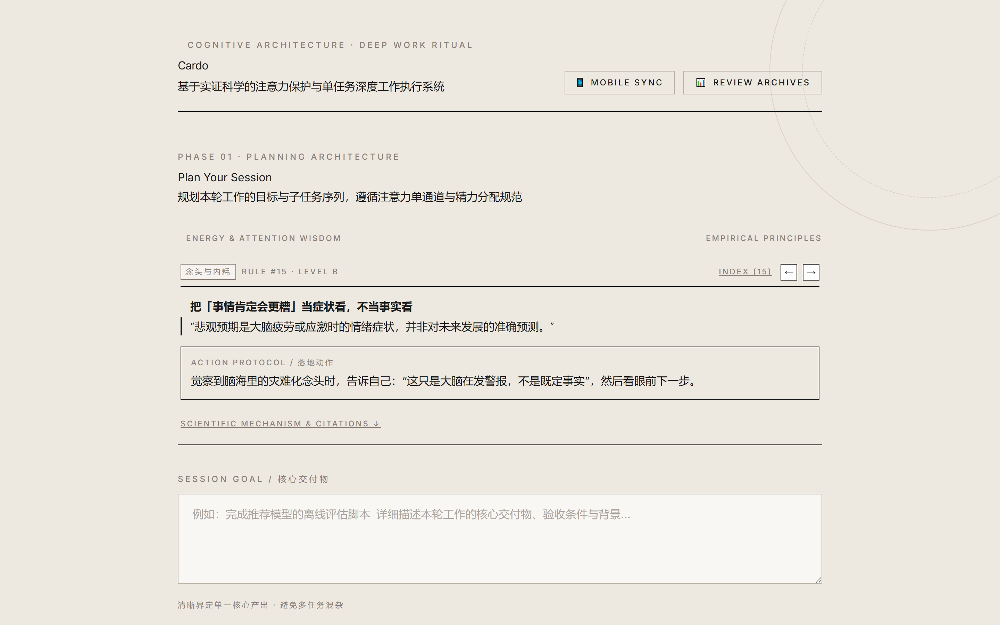
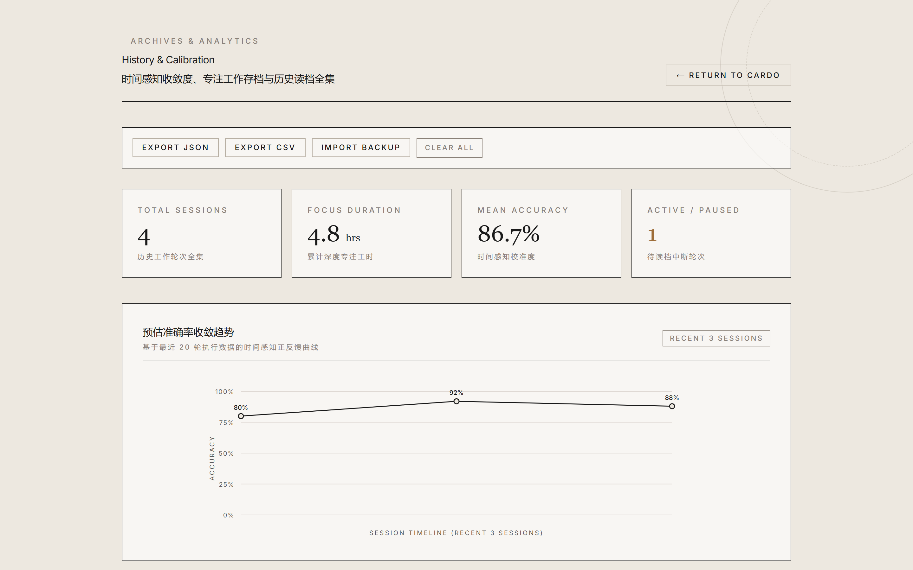
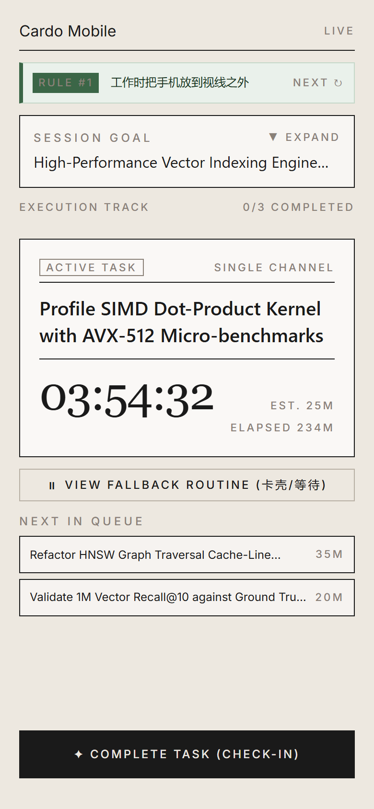

# Cardo · 深度工作与精力管理系统

> **Cardo（卡尔多 / 枢轴）** — 来源于罗马古建筑规划中的核心主轴（Cardo Maximus），旨在注意力碎片化的时代，为心智建立一道免受侵扰的**单通道工作枢轴**。
>
> 结合实证认知科学、注意力恢复理论（ART）与历史时间校准飞轮，彻底解决 **缺乏即时下一任务清单**、**等待空档触发内耗反刍** 与 **时间感知过度乐观** 三大核心痛点。

---

## 🎯 为什么需要 Cardo？（解决三大核心痛点）

在日常高强度脑力与工程研发工作中，开发者和研究者最常见的效率损耗并非来自偷懒，而是源于大脑的工作记忆瓶颈与认知损耗：

1. **痛点一：等待与卡壳时的「空档内耗反刍」**
   - *现象*：等待编译、跑测试或遇到技术卡壳时，大脑容易本能地拿起手机刷社交媒体，或者陷入「焦虑发呆」的空转反刍；被打断后平均需要 **25 分钟** 才能重新找回深度心流。
   - *Cardo 解法*：强制设置 **Fallback Routine（兜底任务）**。卡壳或等待时一键切换至预设的低认知整理活（如读一段文献、整理接口定义、清洗数据），阻断无意识分心。
2. **痛点二：缺乏具体可执行的「即时下一任务清单」**
   - *现象*：总目标过于宏大（如「写完某系统架构」），中途不知所措，导致拖延与反复切换上下文（Attention Residue 注意力残留）。
   - *Cardo 解法*：微积分式原子化拆解（$\le 35$ 分钟单任务），前置 **4 步专注就绪仪式**（物理隔离、通知切断、状态补给、通道锁定），独占当前执行通道。
3. **痛点三：时间规划的「过度乐观与无感失控」**
   - *现象*：永远觉得 10 分钟能搞定，实际耗费两小时，陷入经典的「计划谬误（Planning Fallacy）」。
   - *Cardo 解法*：**基于历史任务完成记录的有参考时间规划**。结合历史同类任务真实耗时进行加权校准，驱动任务规划时间预期**越来越准**。

---

## 📸 功能视图 (Feature Showcase)

| 规划架构 (Planning) | 执行通道 (Execution) |
| :---: | :---: |
|  |  |
| **原子化拆解 · 实证精力法则 · 4 步就绪仪式** | **单通道聚焦 · Didone 艺术计时 · 兜底任务切换** |

| 时间感知校准 (Calibration & History) | 移动端副屏协同 (Mobile Companion) |
| :---: | :---: |
|  |  |
| **预估偏差复盘 · 准确率收敛分析 · 随时读档** | **局域网 Wi-Fi 直连 · 触感震动打卡 · PWA 支持** |

---

## ⚡ 核心功能体系

### 1. Agent 任务智能规划与时间自进化校准飞轮 (Self-Calibrating Engine)
- **Agent 智能工程拆解**：
  - 输入宏观目标，Agent 深度结合本地代码结构与依赖规范，一键拆解为高内聚、可独立验证的原子任务序列（$\le 35$ 分钟/项）。
- **对话式微调 (Interactive Refinement)**：
  - 支持通过自然语言对话无缝调整计划（如「把第2步拆细一点」「为单测多留 15% 缓冲时间」），任务列表自动同步更新。
- **结合历史完成记录的有参考时间规划**：
  - 自动通过语义相似度检索历史归档中相似任务的**真实耗时数据（Actual Minutes）**；
  - 动态进行历史实际用时与大模型预估的加权混合校准；
  - 伴随使用轮次累积，系统越来越懂你的真实工作节奏，**任务规划的时间预期越来越准**。

---

### 2. 深度工作三阶段闭环 (Planning · Execution · Review)
- **阶段一：规划架构 (Planning Architecture)**
  - 任务原子化微积分：宏观目标拆解为 $\le 35$ 分钟的可执行单原子任务。
  - 兜底任务（Fallback Routine）：预设卡壳/等待时的低认知阻断动作。
  - 智能读档恢复：自动感知未完成轮次，支持一键「⚡ 继续读档执行」或「📝 载入到表单」。
  - **4 步专注就绪仪式 (Pre-Flight Protocols)**：
    1. **物理空间净化**：手机移出视线范围、桌面清理、佩戴降噪耳塞。
    2. **数字干扰切断**：关闭通讯软件与桌面通知、开启单窗口全屏。
    3. **生理状态补给**：准备充足饮水、确认室温与自然光照。
    4. **认知通道锁定**：明确第一步物理级可执行动作，锁定单任务通道。

- **阶段二：执行通道 (Execution Channel)**
  - 实时自适应计时器与「↺ 重置计时（Reset Timer）」支持。
  - 极简专注沉浸模式（**Zen Mode**，快捷键 `Alt + Z`）。
  - 全键盘盲操流（`Ctrl + Enter` 标记完成、`Alt + F` 切换兜底任务）。
  - 基于 Web Audio API 动态合成的柔和双音提示音（零外部资源依赖）。
  - 随时「⏸ 暂存读档」，安全保存现场并退回主页。

- **阶段三：反思与时间感知校准 (Reflection & Flywheel)**
  - 预估耗时 vs 实际耗时逐项明细对比与偏差百分比。
  - 准确率量化分析（$\pm 20\%$ 判定为准确）。
  - 时间感知智能校准建议，驱动时间预估能力持续进化。

---

### 3. 智能 Agentic 多模态工程探查 Tooling 套件
集成强大的本地工程与多模态文件探索能力，辅助大模型进行高精准度的任务拆解：
- `inspect_project_structure`：目录深度与树状结构全景扫描。
- `search_files`：基于正则表达式与关键字的多文件内容检索。
- `read_file`：跨文件精读源码与配置文件。
- `read_image`：多模态视觉解析设计稿、架构草图与截图。
- `list_directory` / `find_by_name`：快速定位文件与模块边界。

---

### 4. 局域网跨设备副屏实时协同 (100% 离线安全)
- **专属路由**：`/mobile`
- **局域网 Wi-Fi 直连**：自动嗅探本机内网 IP（`/api/network/ip`），手机扫码即连或直接保存书签。
- **打卡触感震动反馈**：手机点击任务完成时触发硬件级触觉振动（`navigator.vibrate`），实时双向推送到桌面端。
- **PWA 支持**：支持添加到手机桌面主屏幕，全屏独立运行。

---

## 🌿 鸣谢与实证科学致谢 (Acknowledgments)

本项目中的核心精力管理方法论、实证科学机理库与 4 步就绪仪式规范，深度参考并致谢 GitHub 开源项目：

- **[HowToLiveBetter (如何更好地生活 / 《不要浪费精力》)](https://github.com/HowToLiveBetter)**
  - 感谢该知识库对运动抗抑郁（Noetel 2024 BMJ）、微小打断认知成本（Altmann 2014）、手机视线隔离（Ward 2017）、噪音与认知损耗（Jahncke 2011）、睡眠剥夺累积效应（Van Dongen 2003）以及情绪降温机理（Kjærvik 2024）等大量顶级医学与认知科学文献（RCT / Meta-analysis）的系统性梳理。

---

## 🚀 快速启动与部署指南

### 环境依赖
- Node.js 18.17+ 或 20+
- npm / pnpm / yarn

### 安装与运行

```bash
# 1. 克隆代码仓库
git clone https://github.com/Bright-Chengliang/Cardo.git
cd Cardo

# 2. 安装依赖
npm install

# 3. 本地开发模式 (默认端口 3025)
npm run dev

# 4. 生产构建与启动
npm run build
npm start
```

### Windows 无头后台静默启动
内置 PowerShell 无头后台守护脚本，支持一键开机常驻与热重启：
```powershell
# 启动或重启后台服务 (无终端窗口阻塞)
Start-Process powershell -ArgumentList "-NoProfile", "-WindowStyle", "Hidden", "-ExecutionPolicy", "Bypass", "-File", "scripts\start-background.ps1", "-Restart" -WindowStyle Hidden
```
- 服务访问地址：`http://localhost:3025`
- 移动端副屏地址：`http://localhost:3025/mobile`
- 运行日志：`.logs/cardo.log`，PID：`.run/cardo.pid`

---

## ⌨️ 快捷键指南 (Keyboard Shortcuts)

| 快捷键 | 功能说明 |
| :--- | :--- |
| `Ctrl + Enter` / `Cmd + Enter` | 标记当前原子任务完成并切换至下一个 |
| `Alt + Z` | 进入 / 退出极简专注沉浸模式 (Zen Mode) |
| `Alt + F` | 展开 / 折叠反刍阻断兜底任务 (Fallback Routine) |
| `Enter` (在添加输入框中) | 快速添加临时子任务 |

---

## 📄 License
MIT License © 2026 Cardo Contributors.
